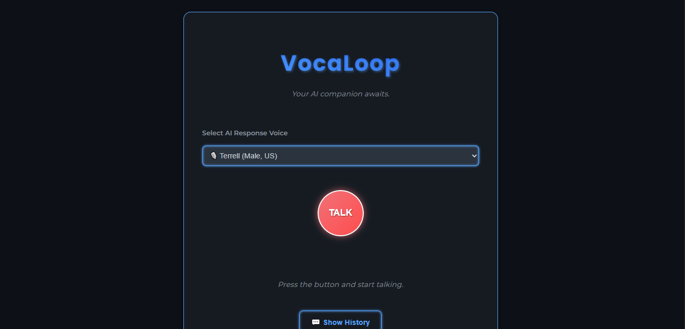

# VocaLoop AI Assistant 🗣️

Welcome to **VocaLoop**, a fully-functional, stateful AI voice agent built as part of the **30 Days of AI Voice Agents** challenge. This project combines cutting-edge speech-to-text, large language models, and text-to-speech services to create a seamless, hands-free conversational experience.

## Introduction
VocaLoop is more than just a simple voice bot; it's a conversational agent with a memory. The application listens to your voice, transcribes it, processes it with an AI, and responds in a lifelike voice, all while remembering the context of your conversation. It's a full-stack project demonstrating a powerful AI pipeline.

## ✨ Features

* **🎙️ Hands-free Conversation:** A single button controls the entire conversation flow, making the experience natural and intuitive.
* **🧠 Stateful Memory:** The agent remembers previous interactions within a session, allowing for coherent and context-aware conversations.
* **💾 Persistent Chat History:** All conversations are saved to a file on the server, so you can revisit your chat logs at any time.
* **🎨 Dynamic UI:** A modern, anime-inspired user interface with a dark theme and interactive elements.
* **🛡️ Robust Error Handling:** The application gracefully handles failures from external APIs, providing user-friendly fallback responses.

## 🏗️ Architecture

The VocaLoop application is built on a robust, modular architecture that orchestrates several AI services to create a complete conversational loop.

1.  **Frontend (UI):** The user interacts with a web-based UI (`index.html`) that uses JavaScript to capture audio from the microphone.
2.  **Speech-to-Text (STT):** The captured audio is sent to the **FastAPI** server.
3.  **Core Logic (FastAPI):** The server's main handler (`main.py`) orchestrates the request by calling services from the **`services.py`** module. It passes the audio to **AssemblyAI** for transcription and the transcribed text and chat history to **Google Gemini**.
4.  **Large Language Model (LLM):** **Google Gemini** generates an intelligent text-based response.
5.  **Text-to-Speech (TTS):** The LLM's text response is sent to **Murf AI**, which generates an audio file.
6.  **Playback:** The Murf AI audio URL is returned to the frontend, where it is played back automatically for the user.

## ⚙️ Technologies Used

* **Backend:** Python, FastAPI
* **Speech-to-Text (STT):** AssemblyAI
* **Large Language Model (LLM):** Google Gemini
* **Text-to-Speech (TTS):** Murf AI
* **Frontend:** HTML, CSS, JavaScript

## 🚀 Getting Started

Follow these steps to get a local copy of the project up and running.

### Prerequisites

You'll need to have **Python 3.8+** and `pip` installed on your machine.

### 1. Set Up Environment Variables

Create a file named `.env` in the root of your project directory. You will need to provide API keys for the services used in the application.

```env
ASSEMBLYAI_API_KEY="your_assemblyai_api_key_here"
MURF_API_KEY="your_murf_api_key_here"
GEMINI_API_KEY="your_gemini_api_key_here"
```


### 2. Install Dependencies

Install the required Python packages using pip.

```bash
pip install -r requirements.txt
```


### 3. Run the Server

Start the FastAPI server. Run the following command in your terminal from the root of your project, as the main file is now named main.py.

```bash
uvicorn main:app --reload --host 0.0.0.0 --port 8000
```

The application will now be accessible in your web browser at http://localhost:8000.

